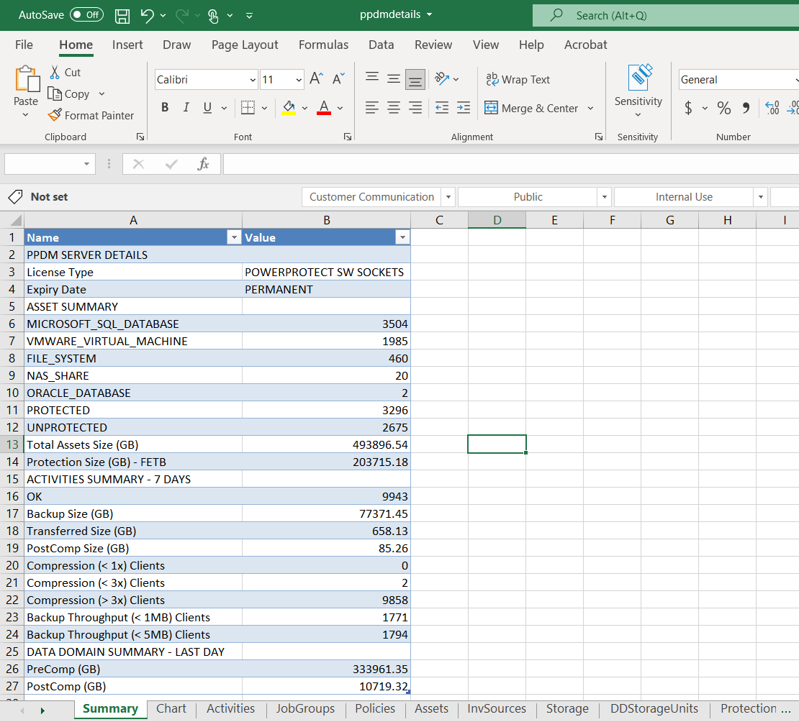

# Assessment Tool for PowerProtect Data Manager

A command line assessment tool developed for Dell PowerProtect Data Manager to provide insights into the backup environment.
This tool (ppdmat) provides a comprehensive report on assets, jobs, data protected, data transferred, throughput, deduplication, data over the period of time, capacity and many more stats that are important to maintain and manage the infrastructure.

This tool will make a series of REST API calls to PPDM to gather information and parse the output to excel sheet. 
I have developed this tool for several reasons, first, to be able to demonstrate how customers can leverage powerful REST API to automate various tasks and second, to be able to provide a report which can give complete insights into the backup environment.
This report can also be used to do capacity trending, chronic clients, low-throughput clients and many other stats to help taking proactive steps and keeping the environment healthy.

This is a v1.0.0 and, based on the feedback, I will invest more time in adding data, graphs and analytics to it.

## Getting Started

**Windows**
The exe is available in Windows Exe folder, download the exe and execute the same. If you are not comfortable running an exe, you can download ppdmat.py file and run the same.

```
ppdmat.exe -s <PPDM IP> -u <user> -p <pwd> -rd <report days>
```

OR

**Windows/Linux**

```
ppdmat.py -s <PPDM NAME / IP> -u <user> -p <pwd> -rd <report days>
```

This will generate an excel sheet in the same folder from where you executed the command.


## Example Output

```
C:\Data\Coding\PPDM Reports\v.0.0.1\dist>ppdmat.exe -s x.x.x.x -u user -p passwd -rd 30
Logged in with user: user to PPDM: x.x.x.x
Written App agents information to ppdmreport.xls
Written Summary information to ppdmreport.xls
Created column chat to ppdmreport.xls
Written 'Activities' information to ppdmreport.xls
Written 'JobGroups' information to ppdmreport.xls
Written 'Policies' information to ppdmreport.xls
Written 'BkpImagesList' information to ppdmreport.xls
Written 'Assets' information to ppdmreport.xls
Written 'InvSources' information to ppdmreport.xls
Written 'Storage' information to ppdmreport.xls
Written 'DDStorageUnits' information to ppdmreport.xls
Written 'ProtectionEngines' information to ppdmreport.xls
Written 'AppAgents' information to ppdmreport.xls
Written 'PPDMServer' information to ppdmreport.xls
Written 'ServerDR' information to ppdmreport.xls
All the data written to the file
Logout for user: user from PPDM: x.x.x.x

C:\Data\Coding\PPDM Reports\v.0.0.1\dist>

```
**Following is a summary of PPDM assessment (exmaple)**



**Following is an another worksheet of the assessment report - capacity trending**


## Contributions

If you're interested in contributing to this project, thank you in advance!
I will help you with the documention to install PPDM, its a virtual appliance, easy to set up.


## Author

* **Raghava Jainoje** - [rjainoje](https://github.com/rjainoje)


## License

This project is licensed under the MIT License - see the [LICENSE](LICENSE) file for details